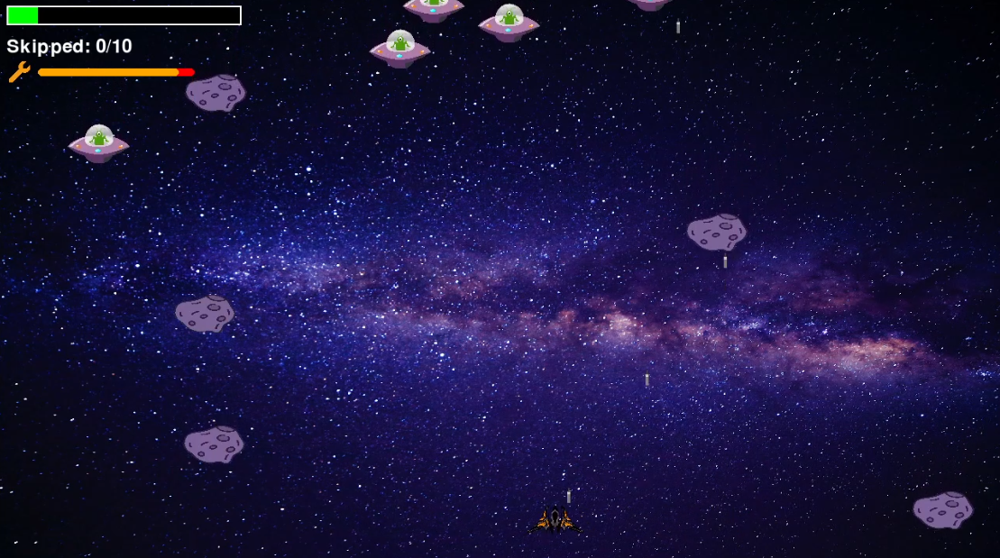
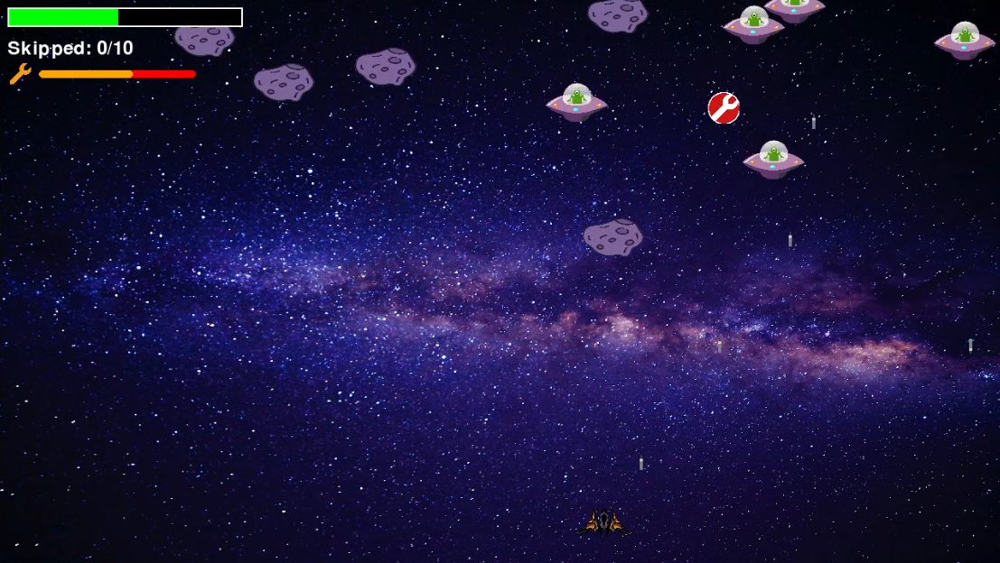

# 🚀 Space Shooter (Pygame)

Простий 2D-шутер у космічному сеттінгу, створений на Python + Pygame.


## 🕹️ Опис

Гравець керує космічним кораблем, який знищує ворожі кораблі, ухиляється від астероїдів і збирає бонуси. Основна мета — набрати якомога більше очок.

## 📦 Вимоги

- Python 3.9

## 🔧 Встановлення залежностей

```bash
pip3 install -r requirements.txt
```

## 🎮 Управління

| Клавіша            | Дія             |
|--------------------|-----------------|
| ← ↑ → ↓ або WASD   | Переміщення     |
| Пробіл             | Стріляти        |
| E                  | Почати гру      |


## 🚀 Запуск гри

```bash
python3 shooter_game.py
```





## 📝 Ліцензія

Цей проєкт ліцензований за умовами MIT License.
